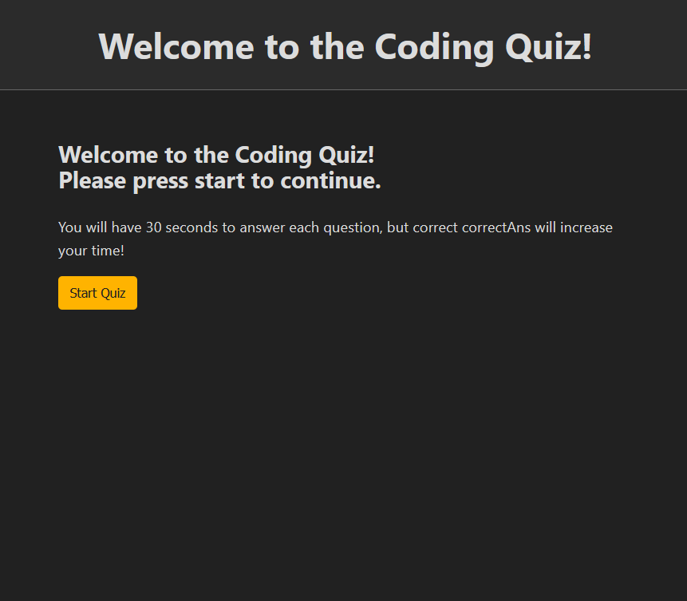
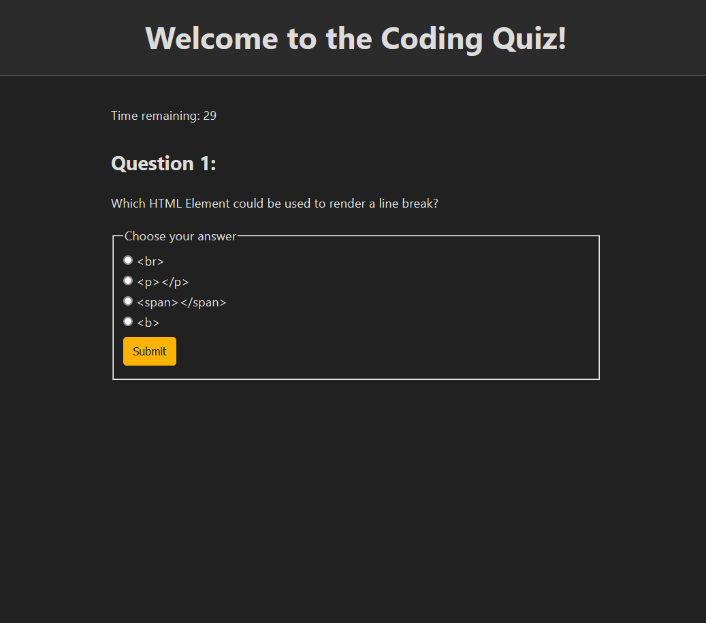
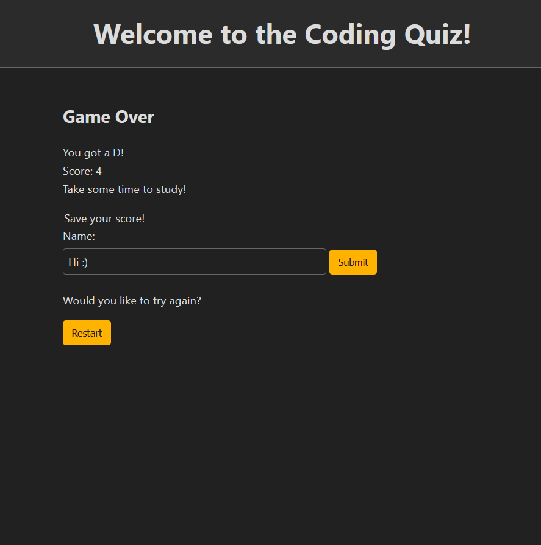

# Coding Quiz

## Description

For this project, I created a timed quiz composed of programming questions, all from scratch. Starting there, I focused on refining my step-by-step modular process from last project (the password generator), which I feel worked out much better this time. I focused a lot on what essential mechanics of the program would need to function before I could start letting it get too fancy, requiring a fair deal of discipline not to get too crazy with coding until everything was properly working. In this I definitely succeeded. The quiz successfully navigates itself through a series of questions while accurately tracking player input. I even decided to add a letter grade at the end, to further push that fun "quizzy" vibe.

I do feel that I fell a fair bit short on adding a proper leaderboard to the quiz, though. Right now, the quiz will only save one name and score set at a time, so a user who wants to track their scores over time would have to get out a pen and paper. Needless to say, that's fairly sub-optimal. The reason for this is purely born out of the frustration I was having with figuring out how localStorage works with JavaScript and it's, unfortunately, still elusive to me even after the project's "completion." I would really like to revisit the code sometime later just to add that functionality, if for no other reason than to resolve that lingering frustration.

## Usage

To use, just click the "Start" button and answer the questions in sequence. Your score will be tracked, and when the quiz is over you may record your score along with your name or simply restart the quiz, which takes you back to the landing page. To view your last saved score, open your browser's developer console and look in Local Storage.

## Credits

Credit for the CSS reset goes to simple.css, a CSS framework that helped me get the project looking nice in less time than it would have taken if I wrote the CSS myself.

## License

Feel free to use this project however you like.

I fully appreciate any and all commits if you want to demonstrate suggestions for improving the code!